# UNIbot Plugin for Open edX

This guide explains how to install and configure the UNIbot plugin for Open edX.

## Prerequisites

- Python virtual environment
- Access to Open edX admin interface
- Tutor installation rights

## 1. Environment Setup

### Create and Activate Virtual Environment

```bash
python -m venv venv

# Windows
source venv/Scripts/activate

# Linux/MacOS
source venv/bin/activate
```

### Install Tutor

```bash
pip install tutor[full]
```

## 2. UNIbot Plugin Installation

1. Create and navigate to plugins directory:

```bash
mkdir plugins && cd plugins
```

2. Clone the plugin repository:

```bash
git clone https://git.intela.dev/open-source/uni-bot-on-open-edx/tutor-unibot.git
```

3. Install the plugin:

```bash
pip install -e /path/to/plugins-folder/tutor-unibot
```

4. Verify installation:

```bash
tutor plugins list
```

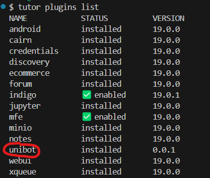

5. Enable the plugin:

```bash
tutor plugins enable unibot
```

After enabling, you should see a green checkmark next to "unibot" in the plugins list:
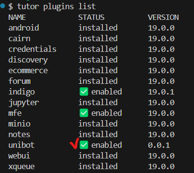

6. Build required images:

```bash
tutor images build openedx && tutor images build mfe
```

7. (Optional) Launch local environment:

```bash
tutor local launch
```

## 3. OAuth Configuration

### Enable API Access

1. Navigate to `<LMS_URL>/admin/api_admin/apiaccessconfig/`
2. Click "Add API Access Config"
3. Enable the configuration and save
   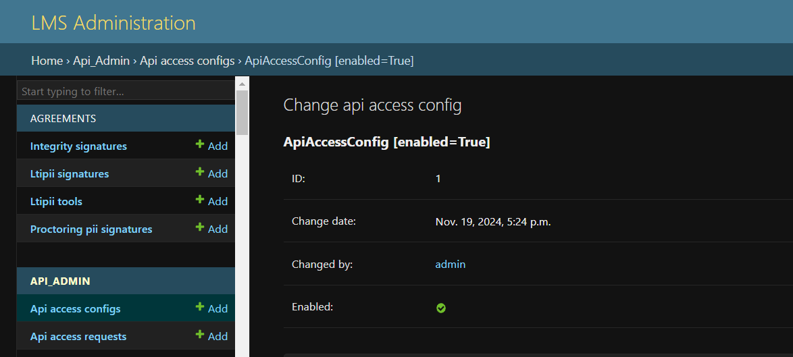

### Generate API Credentials

1. Go to `<LMS_URL>/api-admin/` and submit an access request
   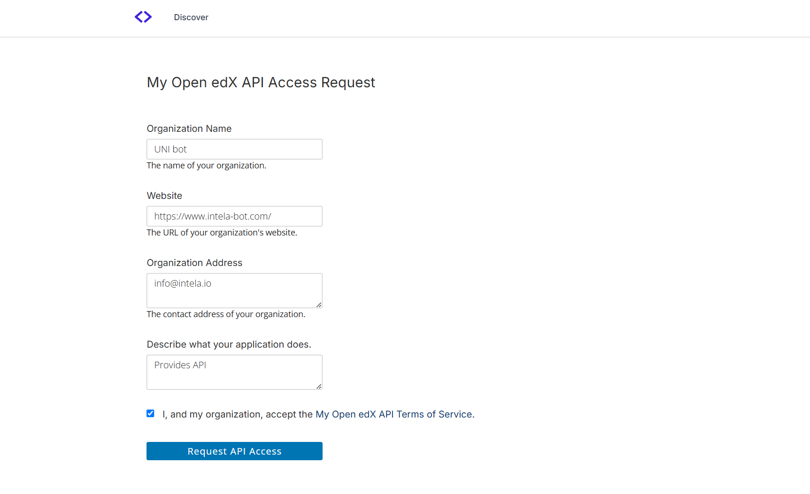

2. Approve the request:

   - Navigate to `<LMS_URL>/admin/api_admin/apiaccessrequest/`
   - Change status from "Pending" to "Approved"
     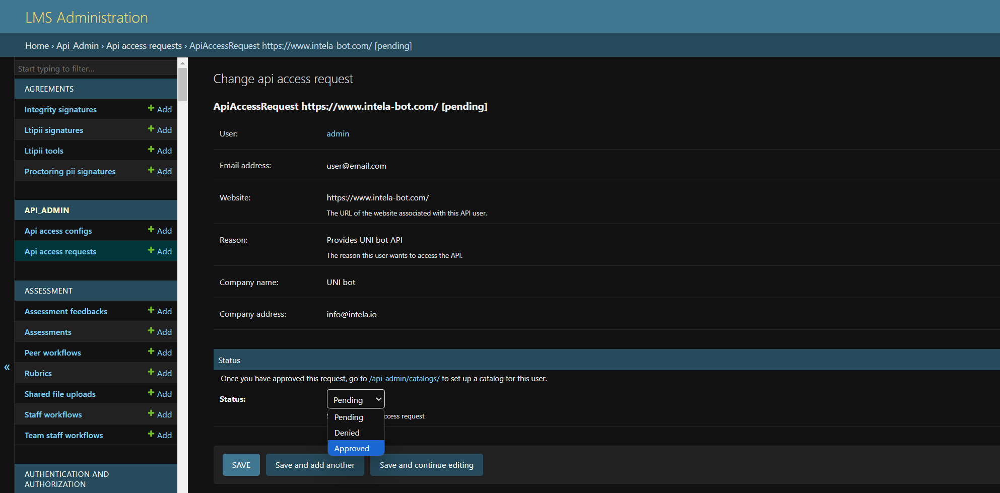

3. Obtain credentials:
   - Visit `<LMS_URL>/api-admin/status/`
   - Create a new token
     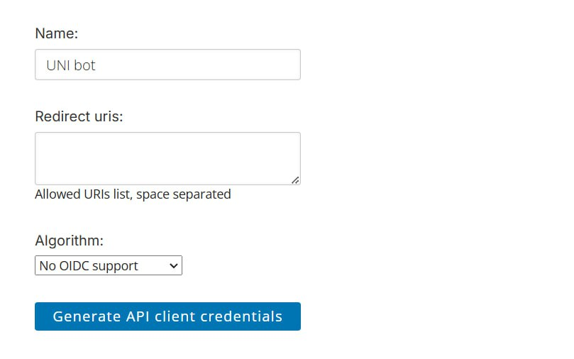
   - Save the provided API Client ID and Secret
     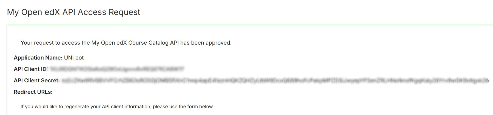

## 4. UNIbot Backend Registration

1. Access the UNIbot Meta-Admin application at https://unibot-sf.san.systems/meta-admin/
   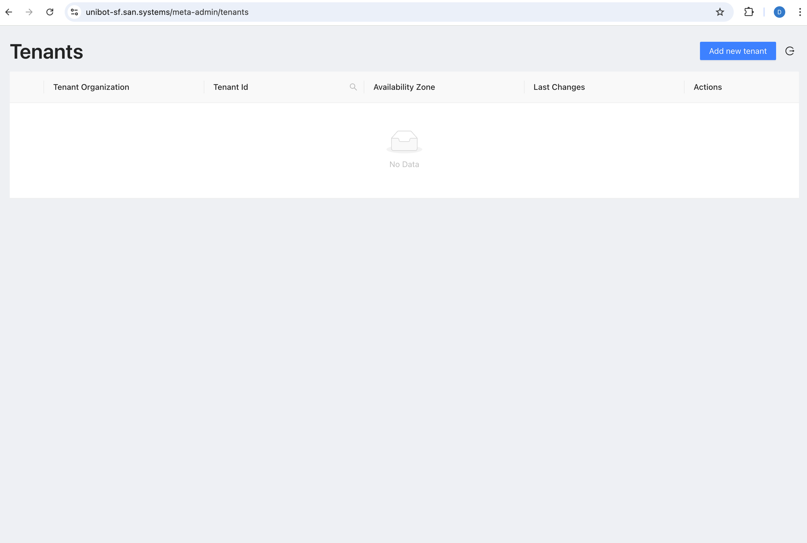

2. Add new tenant:
   - Click "Add new tenant" in the top right corner
   - Fill in the form with your OAuth credentials
     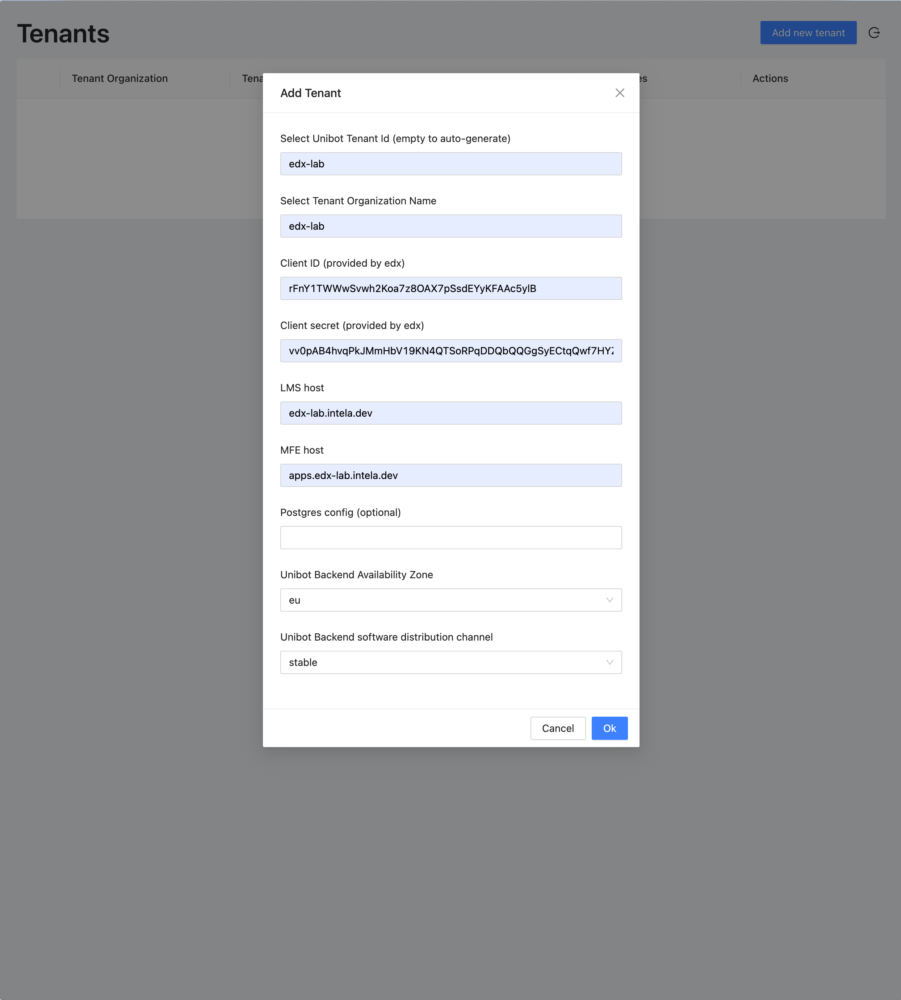
   - Save and note the tenant credentials
     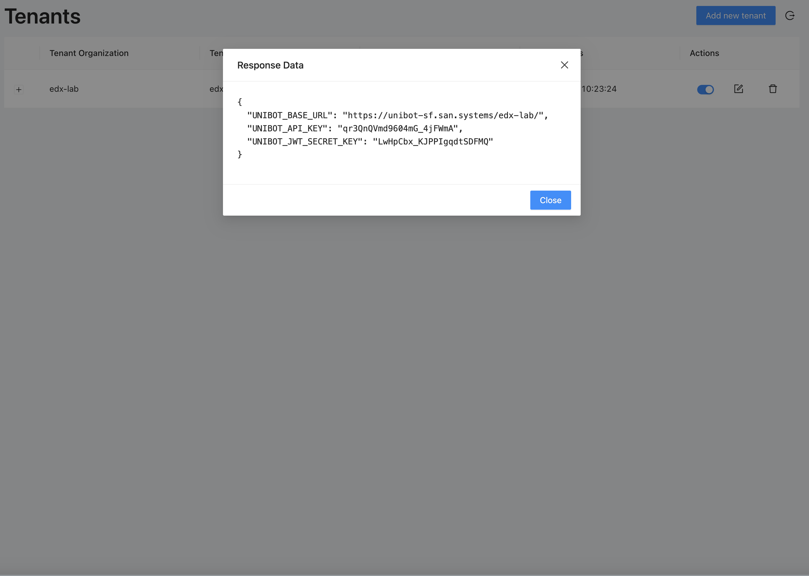

## 5. Open edX Configuration

1. Configure UNIbot Settings:

   - Access Open edX LMS admin page
   - Navigate to UNIbot settings
     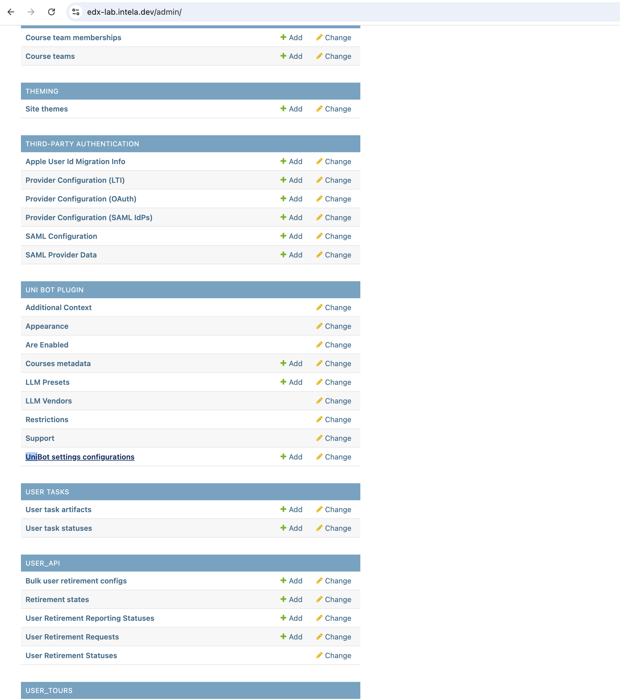
   - Add new configuration
     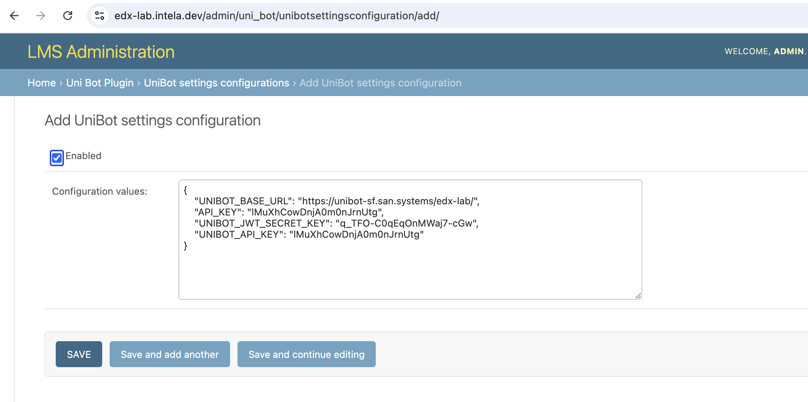
   - Enter Meta-Admin credentials and enable the configuration

2. Update Site Configuration:
   - Navigate to site configuration in LMS admin panel
     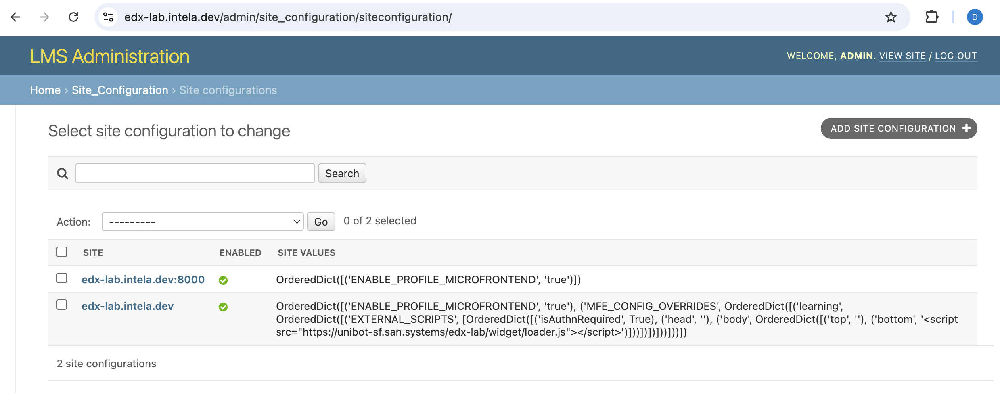
   - Select the site without ports in the name
   - Add the following JSON configuration (replace `<BACKEND_URL>` with your actual backend URL):

```json
{
  "ENABLE_PROFILE_MICROFRONTEND": "true",
  "MFE_CONFIG_OVERRIDES": {
    "learning": {
      "EXTERNAL_SCRIPTS": [
        {
          "isAuthnRequired": true,
          "head": "",
          "body": {
            "top": "",
            "bottom": "<script src=\"<BACKEND_URL>/widget/loader.js\"></script>"
          }
        }
      ]
    }
  }
}
```

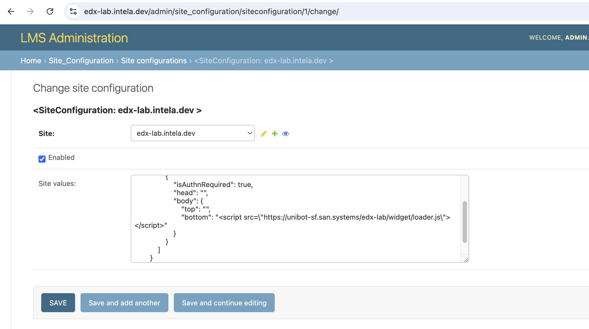
